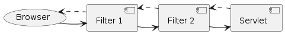

# 쿠키와 세션 이해하기 쉬운 가이드

## 🍪 쿠키(Cookie)란?

쿠키는 웹사이트가 여러분의 브라우저에 저장하는 작은 데이터 조각입니다. 마치 쇼핑몰에서 받는 영수증처럼, 나중에 다시 방문했을 때 웹사이트가 여러분을 기억할 수 있게 해줍니다.

### 쿠키의 주요 특징
- 브라우저에 저장됨 (여러분의 컴퓨터에 저장)
- 이름과 값이 한 쌍으로 저장 (예: username=john)
- 유효기간 설정 가능
- 최대 4KB까지 저장 가능

### 쿠키 사용 예시
```java
// 쿠키 만들기
Cookie cookie = new Cookie("username", "john");
cookie.setMaxAge(7 * 24 * 60 * 60); // 7일 동안 유효
response.addCookie(cookie);

// 쿠키 읽기
Cookie cookie = CookieUtils.getCookie(request, "username");
String username = cookie.getValue(); // "john"
```
---
# 🎫 세션(Session)이란?

세션은 웹사이트가 서버에 저장하는 정보입니다. 마치 도서관 회원증처럼, 방문자마다 고유한 식별자를 부여하고 관련 정보를 서버에 저장합니다.

## 세션의 주요 특징

- 서버에 저장됨 (웹사이트 서버에 저장)
- 브라우저가 닫히면 자동으로 삭제됨  
- 쿠키보다 보안성이 높음
- 저장 용량이 쿠키보다 큼

## 세션 사용 예시
```java
// 세션 시작하기
HttpSession session = request.getSession();
session.setAttribute("userId", "12345");

// 세션에서 정보 가져오기
String userId = (String) session.getAttribute("userId");

// 세션 종료하기
session.invalidate();
```

- 일정 기간 동안 보관 가능 (만료기간)
- 다음에 마트에 갈 때 영수증을 보여주면 구매 이력 확인 가능

## 🎫 세션의 이해 (도서관 회원증 비유)
- 도서관(서버)이 회원 정보를 보관
- 회원증(세션ID)만 사용자가 가지고 다님
- 실제 정보는 도서관(서버)에 안전하게 보관
- 회원증을 잃어버리면 새로 발급받아야 함(새 세션 생성)

## 쿠키vs세션 차이점 

| 구분 | 쿠키 | 세션 |
|------|------|------|
| 저장 위치 | 사용자 브라우저에 저장 | 서버에 저장 (사용자는 세션ID만 가짐) |
| 보안성 | 사용자가 수정할 수 있음 (위조 가능) | 서버에서 관리하므로 안전 |
| 용량 제한 | 브라우저당 최대 4KB | 서버 용량에 따라 유동적 |
| 생명주기 | 만료일자를 지정 (예: 7일, 30일 등) | 브라우저 종료시 자동 삭제 (또는 서버에서 지정한 시간) |

# 💡 Optional과 Null 처리

자바에서 null을 안전하게 처리하는 방법입니다.

## Optional.of vs Optional.ofNullable
```java
// null이 절대 아닌 경우
Optional.of("hello");        // 안전!
Optional.of(null);          // 에러 발생!

// null일 수도 있는 경우
Optional.ofNullable("hello"); // 안전!
Optional.ofNullable(null);    // 안전! (에러 없음)
```

### Null일수도 있는 경우를 고려해서 반드시 ofNullable이 좋을까?
**Optional.of**
- Optional.of를 이용해서 코드의 의도를 명확하게 전달 (이 값은 절대 Null이 아니어야한다)
- Null이 들어오면 NullPointerException을 발생시켜 문제를 조기에 발견할 수 있고
- Null 체크를 하지 않기에 성능상 약간 더 유리하다

**Optional.ofNullable**
- null을 허용하기에 더 유연
- 예외가 발생하지 않고 빈 Optional을 반환해 더 안전
- 외부 데이터 다룰 때 유용

따라서 상황에 따라 적절한 것을 선택하는 것이 중요
- null이 절대 있으면 안되는 경우 : of
- null일 수도 있는 경우 : ofNullable

---

# RequestDispatcher - Interface
- 현재 요청에 대한 정보 저장 후 다른 자원(Servlet, JSP, HTML 등) 으로 전달(forward, include)하는 기능 제공
- 같은 웹 애플리케이션 내 다른 리소스로 요청을 전달하거나 포함하는데 사용되는 객체
- 이는 Servlet API의 일부이며, 웹 애플리케이션에서 Model-View-Controller 아키텍처를 구현하는데 일반적으로 사용

forward(), include() 두가지 메소드 제공
- forward() : JSP 페이지와 같은 다른 리소스로 제어를 전송하는데 사용 
  - 예시로 사용자는 A페이지를 요청했지만 실제로는 B페이지를 보여주고 싶을 때
  - 사용자는 주소창 URL 변경없이 B페이지의 내용을 보게 됨
- include() : 다른 리소스의 출력을 현재 페이지의 출력에 포함 시키는데 사용
  - 예를 들어 모든 페이지에 동일한 헤더, 푸터를 넣고 싶을 때 유용

MVC패턴에서 Controller와 View 사이에 연결을 관리하는데 자주 사용됨
이를 통해 웹 애플리케이션에서 유연한 처리가 가능해지며, 코드 재사용성이 높아짐


## 포워딩과 인클루딩 사용 예시

| 구분 | 포워딩(Forwarding) | 인클루딩(Including) |
|------|-------------------|-------------------|
| 사용 시나리오 | 상품 상세 페이지 조회 | 공통 헤더/푸터 관리 |
| 처리 흐름 | 1. 사용자가 "product.do?id=123" 요청<br>2. ProductServlet이 요청 수신<br>3. DB에서 상품 정보 조회<br>4. "product_detail.jsp"로 포워딩<br>5. 주소창은 원래 URL 유지 | 1. 공통 요소를 "header.jsp", "footer.jsp"로 분리<br>2. 각 페이지에서 공통 요소 include<br>3. 하나의 완성된 페이지로 조합 |
| URL 변화 | 변경되지 않음 (product.do?id=123 유지) | 해당 없음 (페이지 내부 조합) |
| 주요 특징 | • 서버 내부에서 페이지 전환<br>• 요청 정보 유지<br>• 클라이언트는 변화 인지 못함 | • 여러 페이지를 하나로 조합<br>• 코드 재사용성 향상<br>• 유지보수 용이 |


# 웹 페이지 이동 방식: sendRedirect vs forward

## 📋 비교표

| 구분 | sendRedirect (안내 데스크) | forward (내부 이관) |
|------|--------------------------|-------------------|
| 이동 방식 | 새로운 창구로 직접 이동 | 내부적으로 업무 이관 |
| URL 변화 | 변경됨 (새 주소) | 유지됨 (첫 주소) |
| 데이터 유지 | X (새로 입력 필요) | O (기존 데이터 유지) |
| 처리 위치 | 브라우저가 새로 요청 | 서버 내부에서 처리 |
| HTTP 상태코드 | 302 응답 | 상태코드 없음 |

## 💡 핵심 정리

### sendRedirect 사용할 때
- 새로운 URL로 이동이 필요한 경우
- 이전 요청 정보를 유지할 필요가 없을 때
- 예: 로그인 성공 후 메인 페이지로 이동

### forward 사용할 때
- 서버 내부에서만 페이지 전환이 필요한 경우
- 이전 요청 정보를 유지해야 할 때
- 예: 검색 결과를 보여주는 페이지로 이동

---
## forward 사용 시 
```java
 protected void doPost(HttpServletRequest req, HttpServletResponse resp) throws ServletException, IOException {
        String id = req.getParameter("id");
        String pwd = req.getParameter("pwd");

        if(initParamId.equals(id)&& initParamPwd.equals(pwd)){
            HttpSession session = req.getSession();
            session.setAttribute("id",id);
            resp.sendRedirect("/login");
        }
        else {
            log.error("ID/Password 일치하지 않습니다");
//            resp.sendRedirect("/login.html");
            RequestDispatcher rd = req.getRequestDispatcher("/login.html");
            rd.forward(req, resp);
            log.error("id:{}", id);
        }

    }
```
로그인 실패시 rd.forward로 변경해보았다.

일부러 로그인을 실패한 후 새로고침을 실행
```
11:09:38.353 [http-nio-8080-exec-4] ERROR com.nhnacademy.study.LoginServlet - ID/Password 일치하지 않습니다
11:09:38.363 [http-nio-8080-exec-4] ERROR com.nhnacademy.study.LoginServlet - id:admin
11:09:49.045 [http-nio-8080-exec-6] ERROR com.nhnacademy.study.LoginServlet - ID/Password 일치하지 않습니다
11:09:49.049 [http-nio-8080-exec-6] ERROR com.nhnacademy.study.LoginServlet - id:admin
```

1. 현재 rd.forward를 사용중인데 forward는 서버 내부에 요청을 전달하기 때문에
  - URL이 그대로 유지
  - 이전 요청 데이터(form data)가 그대로 유지
  - 브라우저 입장에서는 아직 POST 요청중
2. 이 상태에서 새로고침 시
   - 브라우저는 "이전 POST 요청을 다시 보낼까?"라고 물음
   - 사용자가 확인을 누르면 이전 form data(admin)로 다시 POST 요청을 보냄

하지만 주석 처리한 resp.sendRedirect를 사용한다면
1. 브라우저가 새로운 GET 요청을 보내게 됨
2. 이전 POST 데이터가 유지되지 않음
3. 새로고침해도 form이 재전송되지 않음

### 정리
forward : 서버 내부에서 요청 전달(데이터 유지)->form 재전송 문제 발생 가능
sendRedirect : 브라우저에서 새 요청 지시(데이터 초기화)->form 재전송 문제 없음 

이 예시를 통해 로그인 실패와 같은 상황에서는 sendRedirect를 사용하는것이 더 적절 

---
# Servlet Filter 이해하기 🔍
1. 필터란?
   - 필터는 HTTP 요청과 응답을 가로채 변경할 수 있는 재사용 가능한 코드
   - 정수기 필터처럼 요청이 서블릿에 도달하기 전과 응답이 클라이언트에게 가기 전에 거치는 중간 처리장치

2. 필터 체인 형태로 제공됨

```
[클라이언트 요청]
↓
[필터1 전처리 - request/response 수정 가능]
↓
[필터2 전처리 - request/response 수정 가능]
↓
[서블릿 처리]
↓
[필터2 후처리 - response 수정 가능]
↓
[필터1 후처리 - response 수정 가능]
↓
[클라이언트 응답]
```

🌟**모든 필터는 동일한 request, response 객체를 공유함**

3. 필터 등록 방법

3-1. 어노테이션 사용 
```java
@WebFilter("/admin/*")  // admin으로 시작하는 모든 URL에 적용
public class AdminFilter implements Filter {
    // 필터 구현
}
```

3-2. web.xml 사용
```
<filter>
    <filter-name>logFilter</filter-name>
    <filter-class>com.example.LogFilter</filter-class>
</filter>
<filter-mapping>
    <filter-name>logFilter</filter-name>
    <url-pattern>/*</url-pattern>
</filter-mapping>
```

4. 필터 주요 용도
  - 인증/권한 체크
  - 로깅/감사
  - 이미지/데이터 압축
  - 응답 데이터 암호화
  - XML/JSON 반환
  - 캐싱
  - 인코딩 변환

5. 필터 사용 시 주요 사항
  - chain.doFilter() 메소드를 호출해야 다음 필터로 넘어감
  - 필터 순서가 중요(web.xml에서 설정)
  - 필터에서 예외 발생시 에러 페이지로 리다이렉션됨

6. 필터 주요 메소드
  - init() : 필터 초기화시 1번만 실행, 필터 실행될 때 필요한 리소스 준비(DB 연결, 외부 설정 로드 등 초기와 작업 수행)
  - ✨doFilter() : 실제 필터를 작업을 수행하는 메소드, 요청/응답 때마다 실행
  - doFilter 메소드 기준으로 이전은 전처리 작업 이후는 후처리 작업
```java
public void doFilter(ServletRequest request, 
                    ServletResponse response, 
                    FilterChain chain) throws IOException, ServletException {
    // 전처리 작업
    long startTime = System.currentTimeMillis();
    
    // 다음 필터 또는 서블릿으로 요청 전달 
    chain.doFilter(request, response);
    
    // 후처리 작업
    long endTime = System.currentTimeMillis();
    System.out.println("요청 처리 시간: " + (endTime - startTime) + "ms");
}
```
  - destory() : 필터 종료시 1번만 실행 됨, 리소스 해제 및 연결 종료 등 정리 작업 수행

7. 메소드 실행 순서
```
[서버 시작]
    ↓
[init() 실행]
    ↓
[요청이 올 때마다 doFilter() 실행]
    ↓
[서버 종료시 destroy() 실행]
```

---
# 책임 연쇄 패턴(chain-of-responsibility pattern)
- 필터 체인을 구현하고 다음 필터로 책임을 넘기는 방식
- 각 필터가 요청을 처리하거나 거절 
- 처리 가능하면 다음 필터로 넘김

**장점**
- 처리 객체 간의 결합도를 낮춤 
- 새로운 처리 단계를 쉽게 추가 가능 
- 각 객체는 자신의 책임만 집중

**단점**
- 요청이 꼭 처리된다는 보장 없음
- 디버깅이 어려울 수 있음
---
## 연습문제1
1. 주문페이지를 추가하세요.

path : /order

주문페이지는 회원은 모두 접근할 수 있습니다. ( NONE ) 제외한 모든 회원은 접근가능 합니다.

ADMIN, USER, MANAGER

주문페이지 결과는 OrderResponse.java 파일에 구현하세요.

주문내역은 적당히 System.out.println을 이용하여 표현하세요

2. /main 경로를 호출하면 NotFoundResponse.java 를 구현하세요

/main 경로에 대해서 구현이 안되어 있음으로 "존재하지 않는 페이지!" 노출하도록 구현하세요.

```java
package com.nhnacademy.study.filter;

public class OrderPageFilter implements Filter{
    @Override

    // 주문페이지는 회원은 모두 접근할 수 있습니다. ( NONE ) 제외한 모든 회원은 접근가능 합니다.
    public void doFilter(Request request, FilterChain filterChain) {
        // 1. /order 페이지 요청이라면
        if(request.getPath().equals("/order")){
            // 2. 멤버 정보를 받아오고
            Member member = (Member) request.get("member");
            // 3. None이 아니라면
            if(!member.hasRole(Member.Role.NONE)){
                // 4. 다음 필터로 넘김
                System.out.println("path:" + request.getPath() + " : has ADMIN");
                filterChain.doFilter(request);
            }else{
                System.out.println("path:" + request.getPath() + " : None 등급은 접근 불가능");
            }
        }else{
            System.out.println("OrderPageFilter : 다음 필터로 넘김");
            filterChain.doFilter(request);
        }

    }
}

```

```java
package com.nhnacademy.study.filter;

public class OrderResponse implements  Response{
    @Override
    public void doResponse(Request request) {
        System.out.println("###### response:OrderResponse #####");
        Member member = (Member) request.get("member");
        System.out.println("아이디: " + member.getId());
        System.out.println("이름: " + member.getName());
        System.out.println("\n===== 주문 내역 =====");
        System.out.println("주문번호: ORDER-2024-001");
        System.out.println("주문 상품 목록:");
        System.out.println("1. Java 프로그래밍 기초 - 35,000원");
        System.out.println("2. 스프링 부트 마스터 - 45,000원");
        System.out.println("3. 클린 코드 가이드 - 30,000원");
        System.out.println("------------------------");
        System.out.println("총 주문금액: 110,000원");
        System.out.println("배송지: 경남 김해시 내외동 정우빌딩 5층");
        System.out.println("배송 상태: 배송 준비중");
        System.out.println("===================");

    }
}

```
```java
package com.nhnacademy.study.filter;

import java.util.Iterator;
import java.util.LinkedList;
import java.util.List;


public class FilterChain {

    // 1. 필터를 순서대로 저장할 LinkedList
    private List<Filter> filters = new LinkedList<>();
    // 2. 필터 순차적으로 접근하기 위한 Iterator
    private Iterator iterator;

    // 3. 새로운 필터 추가 메소드
    public void addFilter(Filter filter){
        // 필터 리스트에 새 필터 추가
        this.filters.add(filter);
        // Iterator 초기화(처음부터 다시 시작하도록)
        iterator = filters.iterator();
    }

    // 4. 실제 필터 체인 실행 메소드
    public void doFilter(Request request){
        // 아직 실행할 필터가 남아있다면 다음 필터 가져오기
        if(iterator.hasNext()){
            Filter nextFiilter = (Filter) iterator.next();
            // 해당 필터 실행
            nextFiilter.doFilter(request,this);
        }else{ // 5. 모든 필터 실행이 끝나면
            // 6. 경로에 따른 최종 응답 생성하기
            if(request.getPath().equals("/mypage")){
                new MyPageResponse().doResponse(request);
            }else if(request.getPath().equals("/admin")){
                new AdminPageResponse().doResponse(request);
            }else if(request.getPath().equals("/order")){
                new OrderResponse().doResponse(request);
            }
            else{
                new NotFoundResponse().doResponse(request);
            }
        }
    }

}
/**
 * 필터 체인 동작 원리 설명
 *
 * 영화관 입장 절차를 예로 들면:
 * 1. 티켓 검사
 * 2. 음식물 검사
 * 3. 연령 확인
 *
 * Iterator는 "다음 검사로 이동"하는 역할을 합니다.
 *
 * <pre>
 * // Iterator 없이 구현한다면:
 * for(Filter filter : filters) {
 *     filter.doFilter(request, this);
 * }
 * </pre>
 * 이렇게 하면 모든 필터가 한 번에 다 실행됩니다.
 * 마치 영화관에서 모든 검사를 동시에 하는 것과 같습니다.
 *
 * <pre>
 * // Iterator를 사용하면:
 * if(iterator.hasNext()) {
 *     Filter nextFilter = iterator.next();
 *     nextFilter.doFilter(request, this);
 * }
 * </pre>
 * 이렇게 하면 한 번에 하나의 필터만 실행하고,
 * 각 필터가 다음 필터로 진행할지 말지를 결정할 수 있습니다.
 *
 * 예시:
 * - 티켓이 없으면 → 더 이상 진행 X
 * - 티켓이 있으면 → 음식물 검사로 이동
 * - 음식물 있으면 → 더 이상 진행 X
 * - 음식물 없으면 → 연령 확인으로 이동
 *
 * 이런 식으로 각 단계에서 "다음으로 진행할지 말지"를 결정할 수 있게 됩니다.
 */
```


```java
 public static void main(String[] args) {
        // 기존 테스트
        Request myPageRequest = new Request("/mypage");
        myPageRequest.put("member", Member.createUser("inho", "인호", "1234"));

        Request adminPageRequest = new Request("/admin");
        adminPageRequest.put("member", Member.createAdmin("admin", "관리자", "1234"));

        // 1. 주문 페이지 테스트 - 다양한 권한으로 테스트
        System.out.println("\n############ ADMIN의 /order 요청 ############");
        Request orderRequestAdmin = new Request("/order");
        orderRequestAdmin.put("member", Member.createAdmin("admin", "관리자", "1234"));
        new HttpRequest().doRequest(orderRequestAdmin);

        System.out.println("\n############ USER의 /order 요청 ############");
        Request orderRequestUser = new Request("/order");
        orderRequestUser.put("member", Member.createUser("user", "사용자", "1234"));
        new HttpRequest().doRequest(orderRequestUser);

        System.out.println("\n############ MANAGER의 /order 요청 ############");
        Request orderRequestManager = new Request("/order");
        orderRequestManager.put("member", Member.createManager("manager", "매니저", "1234"));
        new HttpRequest().doRequest(orderRequestManager);

        System.out.println("\n############ NONE의 /order 요청 (접근 불가) ############");
        Request orderRequestNone = new Request("/order");
        orderRequestNone.put("member", Member.createUncertifiedMember("none", "미인증", "1234"));
        new HttpRequest().doRequest(orderRequestNone);

        // 2. 존재하지 않는 페이지 테스트
        System.out.println("\n############ /main 요청 (없는 페이지) ############");
        Request mainRequest = new Request("/main");
        mainRequest.put("member", Member.createUser("user", "사용자", "1234"));
        new HttpRequest().doRequest(mainRequest);
    }
```

--- 
# 필터를 이용한 로그인 여부 처리 &&  encoding 필터
```java
package com.nhnacademy.study.filter;


import jakarta.servlet.ServletException;

import java.io.IOException;

public class CharacterEncodingFilter implements Filter {
    private String encoding = "UTF-8";


    @Override
    public void init(FilterConfig filterConfig) throws ServletException {
        this.encoding = filterConfig.getInitParameter("encoding");
    }

    @Override
    public void doFilter(Request request, FilterChain filterChain) {
        request.setCharacterEncoding(this.encoding);
        System.out.println("###########encoding success!!!!!!");
        filterChain.doFilter(request);
    }


}
```

```java
package com.nhnacademy.study.filter;

import java.util.Arrays;
import java.util.List;

public class LoginCheckFilter implements Filter{
    // 제외할 URL 리스트
    private final List<String> excludeUrls = Arrays.asList(
            "/login",
            "/logout",
            "/login.html"
    );


    @Override
    public void doFilter(Request request, FilterChain filterChain) {
        if(excludeUrls.contains(request.getPath())){
            System.out.println("제외된 URL:" + request.getPath() + " -> 필터 통과");
            filterChain.doFilter(request);
            return;
        }

        // Session Check
        Object session = request.getSession();
        if(session==null){
            System.out.println("세션이 없어 로그인 페이지로 이동합니다");
            System.out.println("Redirect to /login.html");
        }


    }
}

```

```java
    public static void main(String[] args) {
        // 세션이 없는 요청
        Request noSessionRequest = new Request("/mypage");
        System.out.println("\n############ 세션 없는 요청 ############");
        new HttpRequest().doRequest(noSessionRequest);

        // 세션이 있는 요청
        Request withSessionRequest = new Request("/mypage");
        withSessionRequest.setSession("USER_SESSION");  // 임의의 세션 설정
        withSessionRequest.put("member", Member.createUser("user1", "사용자1", "1234"));
        System.out.println("\n############ 세션 있는 요청 ############");
        new HttpRequest().doRequest(withSessionRequest);
    }
```
**결과 - encoding **
```

############ ADMIN의 /order 요청 ############
###########encoding success!!!!!!
MyPageCheckFilter : 다음 필터로 넘김 !
MyPageCheckFilter : 다음 필터로 넘김 !
path:/order : has ADMIN
###### response:OrderResponse #####
아이디: admin
이름: 관리자

===== 주문 내역 =====
주문번호: ORDER-2024-001
주문 상품 목록:
1. Java 프로그래밍 기초 - 35,000원
2. 스프링 부트 마스터 - 45,000원
3. 클린 코드 가이드 - 30,000원
------------------------
총 주문금액: 110,000원
배송지: 경남 김해시 내외동 정우빌딩 5층
배송 상태: 배송 준비중
===================

############ USER의 /order 요청 ############
###########encoding success!!!!!!
MyPageCheckFilter : 다음 필터로 넘김 !
MyPageCheckFilter : 다음 필터로 넘김 !
path:/order : has ADMIN
###### response:OrderResponse #####
아이디: user
이름: 사용자

===== 주문 내역 =====
주문번호: ORDER-2024-001
주문 상품 목록:
1. Java 프로그래밍 기초 - 35,000원
2. 스프링 부트 마스터 - 45,000원
3. 클린 코드 가이드 - 30,000원
------------------------
총 주문금액: 110,000원
배송지: 경남 김해시 내외동 정우빌딩 5층
배송 상태: 배송 준비중
===================

############ MANAGER의 /order 요청 ############
###########encoding success!!!!!!
MyPageCheckFilter : 다음 필터로 넘김 !
MyPageCheckFilter : 다음 필터로 넘김 !
path:/order : has ADMIN
###### response:OrderResponse #####
아이디: manager
이름: 매니저

===== 주문 내역 =====
주문번호: ORDER-2024-001
주문 상품 목록:
1. Java 프로그래밍 기초 - 35,000원
2. 스프링 부트 마스터 - 45,000원
3. 클린 코드 가이드 - 30,000원
------------------------
총 주문금액: 110,000원
배송지: 경남 김해시 내외동 정우빌딩 5층
배송 상태: 배송 준비중
===================

############ NONE의 /order 요청 (접근 불가) ############
###########encoding success!!!!!!
MyPageCheckFilter : 다음 필터로 넘김 !
MyPageCheckFilter : 다음 필터로 넘김 !
path:/order : None 등급은 접근 불가능

############ /main 요청 (없는 페이지) ############
###########encoding success!!!!!!
MyPageCheckFilter : 다음 필터로 넘김 !
MyPageCheckFilter : 다음 필터로 넘김 !
OrderPageFilter : 다음 필터로 넘김
###### response:NotFoundResponse #####
----------------------------------------
Error 404: 존재하지 않는 페이지!
요청한 경로: /main
----------------------------------------
올바른 경로인지 확인해주세요.
사용 가능한 경로: /admin, /mypage, /order
```
**결과 - session&login**
```
############ 세션 없는 요청 ############
세션이 없어 로그인 페이지로 이동합니다
Redirect to /login.html

############ 세션 있는 요청 ############

종료 코드 0(으)로 완료된 프로세스
```
